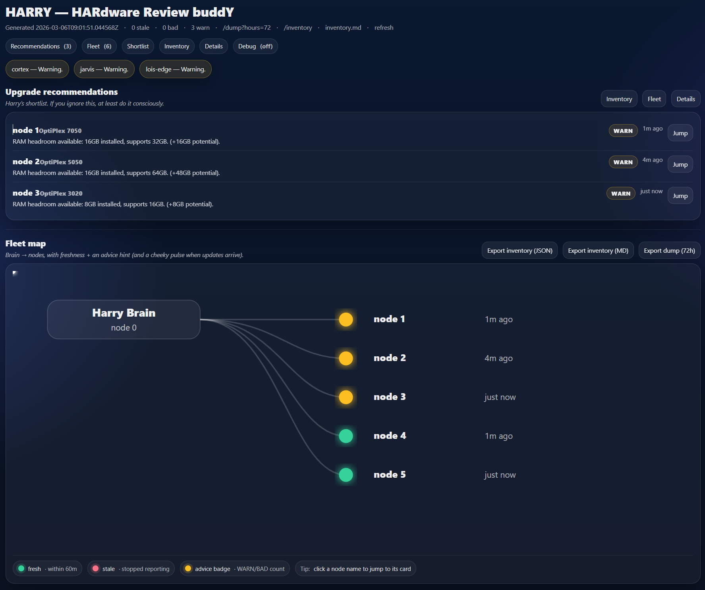
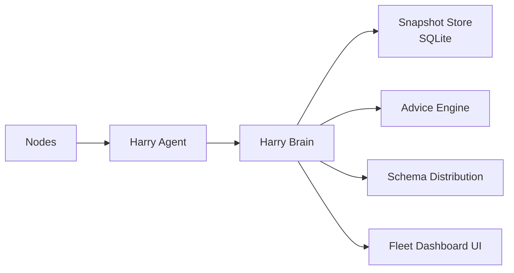

# 🧠 Harry — HARdware Review buddY
Hardware awareness for small infrastructure environments.

Experimental • Home Lab Tool • Quiet Infrastructure




Harry is a lightweight hardware awareness layer for small multi-node home labs.

It exists because a thing happened:

> I was no longer managing infrastructure — I was remembering it.

Harry reduces cognitive overload by keeping a small fleet visible, comparable, and contract-validated.

If it runs quietly for years, we’ve won. **Boring is good.**

---

## Quick Start

Latest release notes:
https://github.com/samuelwhite/Harry/releases

Clone and start the Brain:

```
git clone https://github.com/samuelwhite/Harry.git
cd Harry
./install.sh
```
The installing host automatically registers itself as a node.

Open:

```
http://localhost:8787
```

Install an agent on a node:

```
export HARRY_BASE_URL="http://<brain-host>:8787"
curl -fsSL "$HARRY_BASE_URL/scripts/install-agent.sh" | sudo -E bash
```

---

## Contents

* [What Harry is (and isn’t)](#what-harry-is-and-isnt)
* [Philosophy](#philosophy)
* [Non-Goals](#non-goals)
* [Architecture](#architecture)
* [Useful Endpoints](#useful-endpoints)
* [Quick Diagnostics](#quick-diagnostics)
* [Install – Brain](#install--brain)
* [Install – Agent](#install--agent)
* [Self-updating model](#self-updating-model)
* [Security notes](#security-notes)
* [Status](#status)

---

# What Harry is (and isn’t)

## Harry does

* collect hardware facts and metrics per node
* validate snapshots against a versioned JSON schema
* store snapshots (SQLite)
* serve a simple fleet overview UI
* distribute a self-updating agent to nodes
* track agent versions across the fleet
* fail loudly on invalid payloads

## Harry does not

* orchestrate workloads
* automate infrastructure decisions
* replace observability platforms
* pretend to be enterprise tooling

---

# Philosophy

Harry exists to reduce **operator cognitive load** in small infrastructure environments.

It assumes:

* you run a handful of machines
* you don’t want to run a full observability stack
* you want quick answers to simple questions like:

> "Which machine is about to become a problem?"

Harry intentionally does **very little**, but tries to do it reliably.

---

# Non-Goals

Harry intentionally avoids becoming a full infrastructure platform.

It will not:

* orchestrate workloads
* replace monitoring stacks
* manage deployments
* automate infrastructure decisions

If you need those things, excellent tools already exist.

---

# Architecture

## Diagram



## Brain

FastAPI + SQLite service.

Endpoints:

`/` — UI
`/health` — health check
`/doctor` — diagnostic report
`/doctor.json` — machine diagnostics
`/api` — API info
`/ingest` — snapshot ingest
`/schema/harry/{version}` — schema distribution
`/dist/harry_agent.sh` — agent distribution
`/scripts/install-agent.sh` — agent installer

---

## Agent

Single-file bash script with embedded Python.

Responsibilities:

* collect system metrics
* produce JSON snapshot
* validate payload structure
* send snapshot to Brain
* self-update automatically

---

# Useful Endpoints

Harry intentionally exposes a very small set of endpoints.

## UI

`/`

Simple fleet overview UI.

---

## Health

`/health`

Minimal health check used by container healthchecks and monitoring.

Returns version information and distribution status.

---

## Doctor Harry

`/doctor`

Human-readable diagnostic report.

Useful for quickly checking database access, snapshot status, and node freshness.

Example output:

```
Doctor Harry
===========
ok: True
brain_version: 2026.03.08
agent_version: 0.2.3
```

---

## Doctor (JSON)

`/doctor.json`

Machine-readable diagnostics endpoint.

Intended for automation, scripts, and monitoring integrations.

---

## Agent Distribution

`/dist/harry_agent.sh`

Serves the current agent version to nodes.

Agents check this automatically during execution and self-update if needed.

---

## Agent Installer

`/scripts/install-agent.sh`

Convenience installer for nodes.

Used by the standard installation command:

```
export HARRY_BASE_URL="http://<brain-host>:8787"
curl -fsSL "$HARRY_BASE_URL/scripts/install-agent.sh" | sudo -E bash
```

---

# Quick Diagnostics

Once the Brain is running, you can quickly verify system health.

Human-readable report:

```
curl http://<brain-host>:8787/doctor
```

Structured JSON output:

```
curl http://<brain-host>:8787/doctor.json
```

---

# Install – Brain

## Requirements

* Docker
* Docker Compose plugin

Run:

```
./install.sh
```

Optional:

```
./install.sh --listen 127.0.0.1
./install.sh --port 8788
./install.sh --dir ~/harry
./install.sh --project harrytest
```

After install:

```
UI:     http://<host>:8787
Health: http://<host>:8787/health
```

---

# Install – Agent

On each node:

```
export HARRY_BASE_URL="http://<brain-host>:8787"

curl -fsSL "$HARRY_BASE_URL/scripts/install-agent.sh" | sudo -E bash
```

This installs:

```
/opt/harry/agent/harry_agent.sh
harry-agent.service
harry-agent.timer
```

The agent runs every **5 minutes**.

---

# Self-updating model

On each execution the agent:

1. downloads `/dist/harry_agent.sh`
2. compares SHA256
3. replaces itself if changed
4. re-executes

Updating the Brain agent file updates the entire fleet.

---

# Security notes

Agents only push data.

The Brain **never SSHs into nodes**.

If exposed beyond your LAN, run behind an HTTPS reverse proxy.

Authentication is intentionally **not implemented yet**.

This project is intended for **trusted networks / home labs**.

---

# Status

Harry is an experimental home-lab tool.

If it runs quietly for years without attention, the design succeeded.
