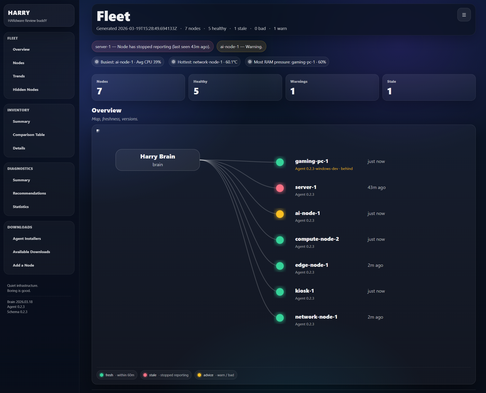
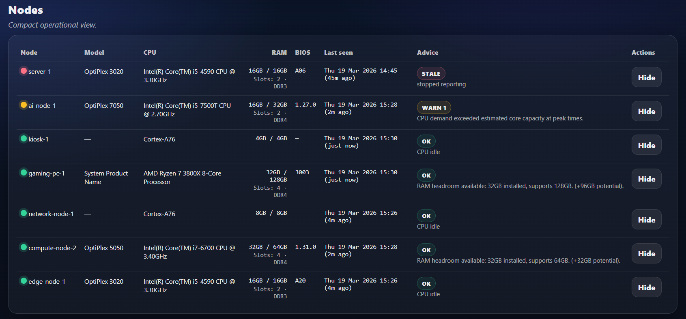

# 🧠 Harry — HARdware Review buddY

Hardware awareness for small infrastructure environments.

Experimental • Home Lab Tool • Quiet Infrastructure

Harry is a lightweight **hardware awareness layer** for small multi-node environments.

It exists because a thing happened:

> I was no longer managing infrastructure — I was remembering it.

Harry reduces cognitive overload by keeping a fleet **visible, comparable, and contract-validated**.

If it runs quietly for years, we’ve won. **Boring is good.**

---

# 🚀 Quick Start

## 🪟 Windows (Easiest Setup)

Download the latest installer from this repository's Releases page.

Run:

HarryBrainSetup.exe

The installer will:

• install Harry Brain  
• install the local Agent  
• configure services  
• open firewall ports as needed
• start everything automatically  
• open the dashboard  

Then open:

http://localhost:8787

Your machine will automatically register as the first node.

If you need the discovery-aware Windows installer downloads directly from the Downloads page, use the Brain or Agent installer links and let them find Harry Brain automatically.

If you want to rebuild the Windows installer EXEs themselves, run:

`pwsh -File scripts/build-windows-installer.ps1`
`pwsh -File scripts/build-windows-brain-installer.ps1`

That script expects Inno Setup 6 (`ISCC.exe`) to be available.

That refreshes the packaged Windows artifacts and writes:

`downloads/HarryAgentSetup.exe`
`downloads/HarryAgentSetup.manifest.json`
`downloads/HarryBrainSetup.exe`
`downloads/HarryBrainSetup.manifest.json`

To verify the installer path:

`downloads/HarryAgentSetup.exe`
`downloads/HarryBrainSetup.exe`

The installers should reflect Brain `2026.05.15`, Agent `0.2.5`, and Schema `0.2.3`.

Harry’s stable Windows installer artifacts are committed in `downloads/`, so a normal `git pull` or `sudo /opt/harry/scripts/update-harry.sh` refreshes them with the repo.

For an optional manual build-and-copy flow:

`pwsh -File scripts/release-windows-installer.ps1 -TargetHost <brain-host> -TargetUser <ssh-user>`

For optional manual copy:

`scp downloads\HarryAgentSetup.exe <ssh-user>@<brain-host>:/opt/harry/downloads/`
`scp downloads\HarryAgentSetup.manifest.json <ssh-user>@<brain-host>:/opt/harry/downloads/`
`scp downloads\HarryBrainSetup.exe <ssh-user>@<brain-host>:/opt/harry/downloads/`
`scp downloads\HarryBrainSetup.manifest.json <ssh-user>@<brain-host>:/opt/harry/downloads/`

On the Brain, verify the artifact and served download:

`cat /opt/harry/downloads/HarryAgentSetup.manifest.json`
`cat /opt/harry/downloads/HarryBrainSetup.manifest.json`
`curl -o /tmp/HarryAgentSetup.exe http://127.0.0.1:8789/downloads/windows-agent`
`curl -o /tmp/HarryBrainSetup.exe http://127.0.0.1:8789/downloads/windows-brain`

Notes:

`HarryAgentSetup.exe` and `HarryBrainSetup.exe` are generated, but committed here as the latest stable artifacts.
The manifests prevent stale installers from being served silently.
The build step requires Inno Setup 6 and `ISCC.exe` on PATH or installed in the default location.
The deploy helper is optional for manual copies, not required for normal updates.

Windows install logs are written to:

`C:\ProgramData\Harry\logs\HarryAgent.install.log`
`C:\ProgramData\Harry\logs\HarryAgent.runtime.log`
`C:\ProgramData\Harry\logs\HarryAgentService.wrapper.log`
`C:\ProgramData\Harry\logs\HarryAgentService.out.log`
`C:\ProgramData\Harry\logs\HarryAgentService.err.log`
`C:\ProgramData\Harry\diagnose.ps1`

During install, the Windows wizard lets you choose automatic discovery or a manual Brain address.
After install, the Windows agent validates its first telemetry send automatically.
For local diagnostics on an installed machine:

`C:\ProgramData\Harry\diagnose.ps1`
`C:\ProgramData\Harry\harry_agent.exe --diagnostics`
`C:\ProgramData\Harry\harry_agent.exe --send-once`
`C:\ProgramData\Harry\harry_agent.exe --once`

---

## 🐧 Linux Brain (Most Stable)

git clone <repo-url>
cd Harry
./install.sh

After install:

UI:     http://localhost:8787
Health: http://localhost:8787/health
Public agent address example: HARRY_PUBLIC_BASE_URL=http://<brain-ip>:8789
Public agent LAN override: HARRY_BRAIN_LAN_IP=<brain-ip> HARRY_PUBLIC_PORT=8789

When you want to refresh a local Brain checkout safely:

`sudo /opt/harry/scripts/update-harry.sh`

Optional alias:

`alias update-harry='sudo /opt/harry/scripts/update-harry.sh'`

---

## ➕ Add another machine

### From the UI (Recommended)

Use the Downloads page.

It provides:

• pre-configured installers  
• the correct Brain address  
• step-by-step onboarding  

---

### Linux Agent

export HARRY_PUBLIC_BASE_URL="http://<brain-ip>:8789"

curl -fsSL "$HARRY_PUBLIC_BASE_URL/scripts/install-agent.sh" | sudo -E bash

### Synology NAS

Enable SSH on the NAS, then run the Linux installer command from a shell:

`curl -fsSL "http://<brain-ip>:8789/downloads/linux-agent" | sudo -E bash`

If DSM scheduling is needed, create a Control Panel > Task Scheduler > Create > Scheduled Task > User-defined script task and paste the command printed by the installer.

---

### Windows Agent

Run:

install_agent.ps1

Tip: The script will try to discover Harry Brain automatically before asking for a manual address.

---

# 🧠 How Harry Works

Harry consists of two components:

- Brain — central service that collects, stores, and visualises data  
- Agent — lightweight process installed on each machine  

Agents send hardware and health data to the Brain over HTTP.

The Brain provides a UI to:

• view your fleet  
• compare hardware  
• detect issues early  

---

# 🧭 UI Overview

Fleet  
• overview  
• nodes  
• trends  
• hidden nodes  

Inventory  
• summary  
• comparison table  
• node details  

Diagnostics  
• summary  
• recommendations  
• statistics  

Downloads  
• installers  
• Brain address  
• onboarding steps  

---

# 🌐 Networking Notes

Harry Agents must reach the Brain over HTTP.

Default Brain listen port:
8789

Example public agent-facing address:
HARRY_PUBLIC_BASE_URL=http://<brain-ip>:8789
HARRY_BRAIN_LAN_IP=<brain-ip> HARRY_PUBLIC_PORT=8789

Requirements:

• allow TCP port 8789 through firewall
• ensure machines can reach the Brain  

Different subnets?

• routing must be enabled  
• firewall rules must allow traffic  

Test connectivity (from the machine you're installing an Agent on):

Test-NetConnection <brain-ip> -Port 8789

---

# ⚠️ Troubleshooting

Agent cannot connect:

• check Brain is running  
• open Brain URL from Agent machine  
• ensure port 8789 is open

Node not appearing:

• wait ~30 seconds  
• refresh Fleet page  

---

# Architecture

Diagram (Mermaid):

flowchart LR

A[Nodes] --> B[Harry Agent]
B --> C[Harry Brain]

C --> D[Snapshot Store (SQLite)]
C --> E[Advice Engine]
C --> F[Schema Distribution]

C --> G[Fleet Dashboard UI]

---

Brain:

• ingest validated snapshots  
• compute node health  
• store historical data  
• expose UI and APIs  

---

Agent:

Linux:
• bash + embedded Python  
• systemd timer (5 min)  

Windows:
• compiled executable  
• WinSW service  

---

# Useful Endpoints

UI: /
Health: /health
Version: /version
Nodes: /nodes
Doctor: /doctor /doctor.json

Agent:
• /dist/harry_agent.sh
• /scripts/install-agent.sh

---

# Philosophy

Harry exists to reduce cognitive load.

You shouldn’t need to remember your infrastructure.  
You should be able to see it.

If it runs quietly for years — we’ve won.

---

# Status

Linux Agent: Stable  
Windows Agent: Supported  
Linux Brain: Stable  
Windows Brain: Supported  

---

# Security notes

• Agents only push data  
• Brain never SSHs into nodes  
• Use HTTPS if exposed externally  
• No authentication  

Designed for trusted networks / home labs

---

# Closing

If the system fades into the background and just quietly works —
Harry has done its job.
